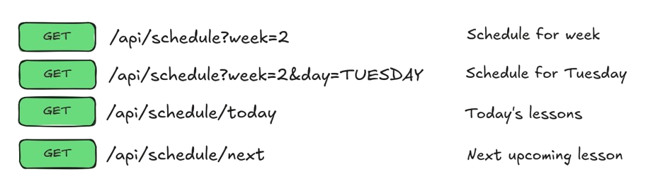
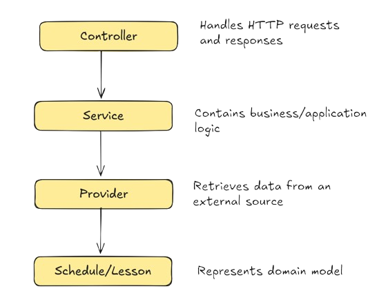

# Schedule Bridge API

A Java/Spring Boot application for working with university schedule data through a REST API and integrating lessons with external services such as Google Calendar.

> [!WARNING]
> ## Project Status: Archived
>
> This project was created as a personal learning project.
>
> Development of the original schedule data-acquisition was discontinued after the source developers confirmed that automated web scraping is strictly prohibited and that no public API is available.
>
> The repository is preserved for educational and portfolio purposes.
> Do not use the scraping component against the original source.

## About

The project started as an experiment in converting a university timetable into Java structured objects and exposing that data through a REST API.

It later became a practical backend project for learning:

- Java
- Spring Boot
- REST API design
- Layered Architecture
- Caching with Caffeine
- unit and controller testing
- date and time handling
- HTML parsing with jsoup

## Features

The API can retrieve a schedule for an academic week, return today's lessons, and determine the next upcoming lesson. Schedule data is represented using a small domain model built around `Schedule` and `Lesson`.

The application also separates HTTP communication, business logic, and schedule acquisition into controller, service, and provider layers.

## API

The application exposes a small REST API for accessing schedule data.

<picture>
  <source media="(prefers-color-scheme: dark)" srcset="assets/img/api-endpoints-dark.png">
  <source media="(prefers-color-scheme: light)" srcset="assets/img/api-endpoints-light.png">
  
</picture>

An individual lesson is represented approximately as:

```json
{
  "date": "2026-09-12",
  "lessonNumber": 3,
  "startTime": "12:10",
  "endTime": "13:45",
  "subject": "English",
  "lessonType": "Lecture",
  "teacher": "Teacher"
}
```

## Technologies

The project is built with **Java 21, Spring Boot and Maven**. It also uses
**jsoup** for HTML parsing, **JUnit and Mockito** for testing, and **Caffeine**
for caching.

Google Calendar integration is also being explored as the final major feature
of the project.

## Architecture

The project follows a simple layered structure:

<picture>
  <source media="(prefers-color-scheme: dark)" srcset="assets/img/architecture-dark.png">
  <source media="(prefers-color-scheme: light)" srcset="assets/img/architecture-light.png">
  
</picture>

## Disclaimer

The original schedule provider explicitly prohibits automated web scraping.
The data-acquisition component in this repository is retained only as part of
the project's development history and should not be used against that service.

## Licence

This repository is publicly available for educational and portfolio purposes.
No permission is granted to copy, modify, distribute, or use the source code
except as permitted by applicable law.

Copyright © 2026 eternaltempted. All rights reserved.

## Author

Developed and maintained by eternaltempted.

GitHub: https://github.com/eternaltempted